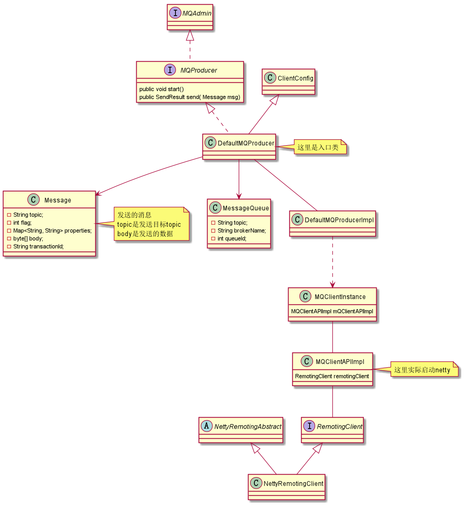

## 默认生成者类的核心类

## 启动流程

3.将clientName设置为本程序的pid，为其他程序读取clintId做准备

# 数据发送和接收
发送和接收都通过netty实现，客户端是netty client 服务器borker是netty Server
## 数据发送流程
TODO

## 数据接收流程
TODO

## [clientId生成规则](clientId生成规则.md)

****

### 一些启动相关的疑问
DefaultMQProducerImpl 的start方法调用2次，好像只是为了发送2次心跳到全部broker
brokerVersion是干什么用的

发送数据流程

发送普通消息
发送定时消息
发送事务消息