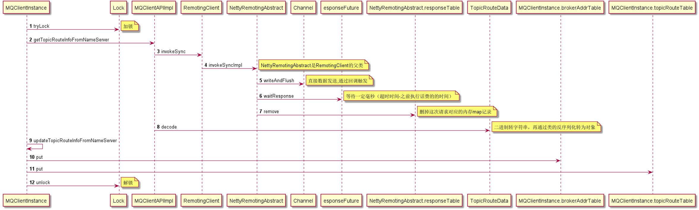

7.启动几个定时任务

时间单位默认毫秒

| 方法名                             | 初始延时  | 时间间隔  |                                           | 功能    | 备注 |
|:-----------------------------------|:----------|:----------|:------------------------------------------|:--------|:----|
| fetchNameServerAddr                | 1000 * 10 | 2分钟     | 取name server的地址                        | 无效代码 |     |
| updateTopicRouteInfoFromNameServer | 10        | 1000 * 30 | 从                                        |         |     |
| cleanOfflineBroker                 | 1000      | 1000 * 30 | 远端拉取topi生产者和消费者信息并同步到本地的 |         |     |
| sendHeartbeatToAllBrokerWithLock   | 1000      | 1000 * 30 |                                           |         |     |
| persistAllConsumerOffset           | 1000 * 10 | 1000 * 5  |                                           |         |     |
| adjustThreadPool                   | 1分钟     | 1分钟     |                                           |         |     |

fetchNameServerAddr
从1个http://jmenv.tbsite.net:8080/rocketmq/nsaddr的地址获取name server，但是实际上该地址是无法访问的

updateTopicRouteInfoFromNameServer
从MQClientInstance类的producerTable，consumerTable取到topic列表，
远端拉取topi生产者和消费者信息,如果和本地数据不一致，那么同步到本地的MQClientInstance类的
brokerAddrTablebrokerAddrTable，producerTable，consumerTable成员

### cleanOfflineBroker
纯本地数据处理
brokerAddrTable中的broker不在topicRouteTable中的话，删除这个broker
topicRouteTable会通过心跳定时获取到更新

### sendHeartbeatToAllBrokerWithLock
向brokerAddrTable中的全部broker发送心跳数据，具体数据结构如下图

返回版本号，并将版本号放入 brokerVersionTable

### persistAllConsumerOffset
将消费者offset持久化
push模式和pull模式持久方法不一样，前者是提交数据到broker，后者是存储在本地文件

### adjustThreadPool
看起来像是调整consumer的线程数，实际代码全部注释，未执行实际操作
