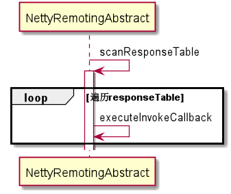

# RemotingClient
通过netty进行数据请求和响应，在netty体系中是client角色。需要主动发起请求，才能收到数据。
目前每次都是创建1个channel进行请求数据，完成后销毁。不具备长连接


## oneWay请求的流程


##  sync请求的流程


## async请求的流程


## 定时执行
NettyRemotingAbstract.scanResponseTable
3秒后执行，每秒执行1次


```java
    /**
     * Execute callback in callback executor. If callback executor is null, run directly in current thread
     */
    private void executeInvokeCallback(final ResponseFuture responseFuture) {
        boolean runInThisThread = false;
        ExecutorService executor = this.getCallbackExecutor();
        if (executor != null) {
            try {
                executor.submit(new Runnable() {
                    @Override
                    public void run() {
                        try {
                            responseFuture.executeInvokeCallback();
                        } catch (Throwable e) {
                            log.warn("execute callback in executor exception, and callback throw", e);
                        } finally {
                            responseFuture.release();
                        }
                    }
                });
            } catch (Exception e) {
                runInThisThread = true;
                log.warn("execute callback in executor exception, maybe executor busy", e);
            }
        } else {
            runInThisThread = true;
        }

        if (runInThisThread) {
            try {
                responseFuture.executeInvokeCallback();
            } catch (Throwable e) {
                log.warn("executeInvokeCallback Exception", e);
            } finally {
                responseFuture.release();
            }
        }
    }
```
以上表示通过线程池的方法，异步执行这个操作

实际几个客户端的默认回调线程如下

### 默认生成者DefaultMQProducer
代码在DefaultMQProducerImpl
```java
this.defaultAsyncSenderExecutor = new ThreadPoolExecutor(
            Runtime.getRuntime().availableProcessors(),
            Runtime.getRuntime().availableProcessors(),
            1000 * 60,
            TimeUnit.MILLISECONDS,
            this.asyncSenderThreadPoolQueue,
            new ThreadFactory() {
                private AtomicInteger threadIndex = new AtomicInteger(0);

                @Override
                public Thread newThread(Runnable r) {
                    return new Thread(r, "AsyncSenderExecutor_" + this.threadIndex.incrementAndGet());
                }
            });
```

消费者疑似没有这个过程
