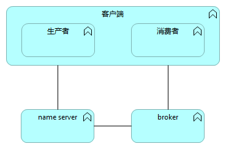
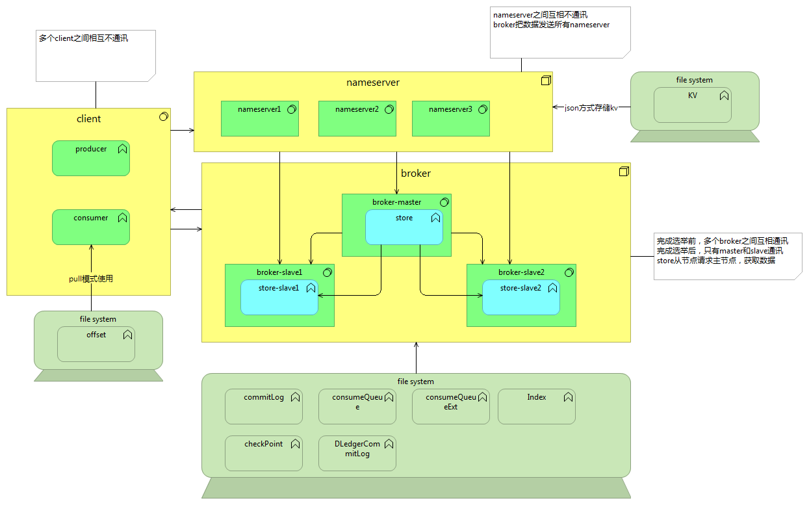

# 前置的概念
客户端
生产者
消费者
nameserver
broker
store
offset

# 整体架构

## 角色

分为客户端，nameserver，broker三个角色。其中客户端又分为生产者和消费者
TODO 好像有1个filter server的角色，后续版本会废弃，这里也不进行分析。

## 通讯关系
客户端之间互相不通讯
nameserver之间互相不通讯
broker之间互相通讯
store是broker的一个子模块，负责存储数据到硬盘。borker之间互相通讯

## 硬盘存储
客户端只有pull模式的消费者，需要把offset存储到远端。

## 客户端详细介绍

clientId生成规则

### 生产者
启动流程

核心类图介绍

发送数据流程

### 推模式的消费者

启动流程

核心类图介绍

接收数据流程

### 拉模式的消费者

### MQClientInstance类

### RemotingClient相关类

## nameserver详细介绍

## broker详细介绍

启动流程

核心类

定时任务

### store详细介绍

硬盘存储结构

核心类

核心流程